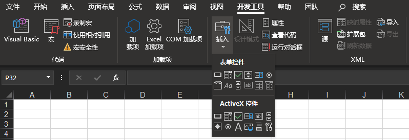
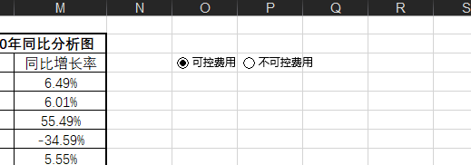

## 10.利用表单控件制作各种动态图  
### 1.插入控件的基本方法和注意事项
---
在使用表单控件之前，需要先勾选
```
文件 -> 选项 -> 自定义功能区 -> 开发工具
```
如图所示。  
  

接着点击 `开发工具` 选项卡，在 `控件` 功能组中单击 `插入` 按钮，就会展开 `表单控件` 列表，如图所示。
  

选择你需要的表单控件插入后，至少要做两个工作：
1. 修改控件的标题
2. 设置控件的控制属性  

后面将进行详细介绍   

### 2.选项按钮使用方法及应用案例
---
选项按钮又称单选按钮，用于选择一组选项中的单个选项。不同组选项同时出现时需要先使用分组框将它们进行分组，如图所示。
  

右键你需要修改格式的控件，选择快捷菜单中的 `设置控件格式` ，即可在弹出的对话框中修改控件的格式。
选项按钮的控制属性如图所示。
  

- 值
    已选择/未选择：即选项按钮的状态是选中还是未选中
- 单元格链接
    将 选项按钮 与 Excel表 中指定单元格的数据链接起来  

> 案例 10-1  可控费用与不可控费用分析
>
> ------
>
> 如案例所示，表格展示了某公司 2019-2020 年每月可控费用和不可控费用的情况。要求实现通过点击选项按钮，实现可以单独查看可控费用或不可控费用的分析图表。
> 效果如图所示，可以使用选择按钮来控制 `2019~2020 年同比分析图` 展示的费用类别。
>   
>
> 通过分析案例，可以将实现过程分为如下几步：
> 1. 制作辅助表格，实现通过改变指定单元格的数据可以切换显示不同年份的费用情况。
> 2. 将此指定单元格作为选项按钮的链接单元格，实现通过改变选项按钮的值可以改变指定单元格的值。
> 3. 以辅助表格的数据绘制图表，实现通过改变选项按钮的值可以改变图表展示的数据。  
>
> 具体步骤如下：
>
> 1. 1. 根据给出的表格制作辅助表格基本结构，如图所示。
>      
>
>    2. 使用 IF 函数让 J2 单元格控制辅助表格的标题，在 K2 单元格输入如下公式：
>    ```excel
>    =IF(J2=1,C2,F2)&"2019-2020年同比分析图"
>    ```
>    实现 J2 = 1 时，标题为 `可控费用2019-2020年同比分析图` ；否则为`不可控费用2019-2020年同比分析图` 。
>    3. 使用 IF 函数让 J2 单元格控制辅助表格的数据，在 K4 单元格输入如下公式：
>    ```excel
>    =IF($J$2=1,C4,F4)
>    ```
>    接着向右向下复制公式，得到辅助表格的所有数据，如图所示。
>      
>    
> 2. 1. 插入两个选项按钮，右键 -> 编辑文字，分别改为 可控费用 和 不可控费用，如图所示。
>      
>    
>    2. 选择任一选项按钮，打开 `设置控件格式` 对话框，将其与 J2 单元格建立链接，如图所示。
>      
>    
> 3. 1. 以辅助表格区域J3:M15的数据绘制组合图，如图所示。
>    
>      
>    
>    2. 在图表标题中输入如下标题，将其与单元格K2链接起来：
>    ```excel
>    =Sheet1!$K$2
>    ```
>    3. 把图表和控件拖动到工作表的适当位置，图表即制作完毕。  
>    
>
> 制作全步骤视频讲解如下：
>
> <video id="video" controls="" preload="none"><source id="mp4" src="./video/1.mp4" type="video/mp4"></video>
